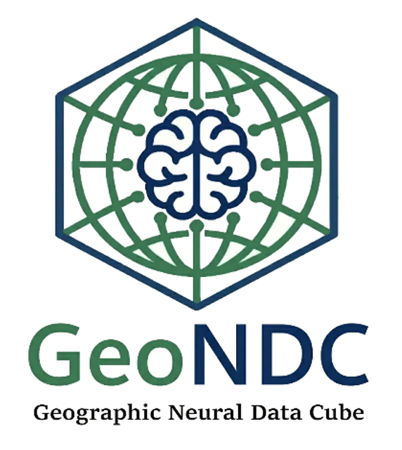

# pygndc

**Geographic Neural Data Cube (GeoNDC)** is a binary Python SDK and an openly
documented file format for compressed, queryable geospatial time-series data.



## What is GeoNDC?

GeoNDC represents an Earth-observation archive as a compact neural data cube.
A `.gndc` file supports spatial, temporal, and point queries without restoring
the complete source archive first.

Key capabilities include:

- continuous-time reconstruction;
- point, window, frame, and time-series queries;
- native CPU and WGPU execution through Vulkan, DirectX 12, or Metal;
- compact storage for long satellite-image time series;
- geospatial metadata, masks, residual correction, and tiled containers.

## Installation

Install the precompiled binary wheel from PyPI:

```bash
pip install pygndc
```

The decoder can be used without an encoder license. Creating new `.gndc` files
requires a valid commercial encoder license:

```bash
pygndc license request -o request.json
pygndc license install license.dat
pygndc license status
```

For an encoder evaluation or commercial license, contact
[jianboqi@126.com](mailto:jianboqi@126.com).

## Documentation

- [Format specification](FORMAT_SPECIFICATION.md)
- [Reader and analysis tutorial](TUTORIAL.md) — task-oriented installation,
  reading, analysis, export, and CLI examples
- [Encoder usage guide](ENCODE_TUTORIAL.md) — licensed encoding workflows and
  configuration examples
- [Python API reference](API_REFERENCE.md) — concise function, class, parameter,
  and return-value reference

## Source and distribution model

This repository publishes the GeoNDC format specification and user
documentation. It does not contain the implementation source code.

The `pygndc` wheel is distributed as proprietary binary software. Decoding is
available without a paid encoder license; encoding is a licensed commercial
feature. Publishing the format specification does not place the binary SDK or
its implementation under an open-source license.

See [LICENSE.md](LICENSE.md) for the documentation and software notices.

## Online viewer and sample data

- [Web viewer](https://www.geondc.org/viewer/)
- [Sample datasets](https://huggingface.co/datasets/geondc/geondc-data)

## Citation

```bibtex
@misc{qi2026geondcqueryableneuraldata,
  title={GeoNDC: A Queryable Neural Data Cube for Planetary-Scale Earth Observation},
  author={Jianbo Qi and Mengyao Li and Baogui Jiang and Yidan Chen and Qiao Wang},
  year={2026},
  eprint={2603.25037},
  archivePrefix={arXiv},
  primaryClass={cs.CV},
  url={https://arxiv.org/abs/2603.25037},
}
```

## Contact

- Author: Jianbo Qi
- Email: jianboqi@126.com
- Website: [geondc.org](https://www.geondc.org/)
- Issues: [GitHub Issues](https://github.com/jianboqi/pygndc/issues)
