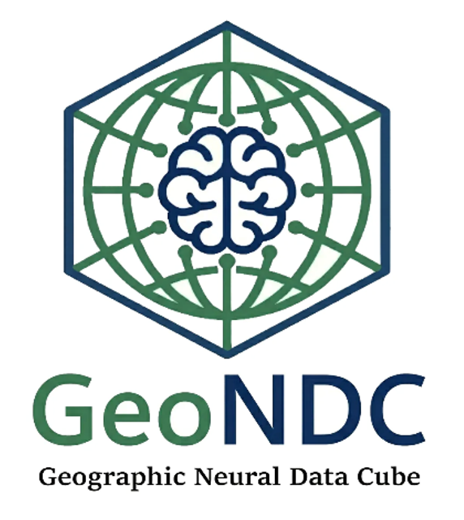

# pygndc

**Geographic Neural Data Cube (GeoNDC)** is a binary Python SDK and an openly
documented file format for compressed, queryable geospatial time-series data.



## What is GeoNDC?

GeoNDC represents an Earth-observation archive as a compact neural data cube.
A `.gndc` file supports spatial, temporal, and point queries without restoring
the complete source archive first.

Key capabilities include:

- continuous-time reconstruction;
- point, window, frame, and time-series queries;
- native CPU, WGPU (Vulkan, DirectX 12, or Metal), and NVIDIA CUDA execution;
- compact storage for long satellite-image time series;
- geospatial metadata, masks, residual correction, and tiled containers.

## Installation

Install the precompiled binary wheel from PyPI:

```bash
pip install pygndc
```

Prebuilt packages support Python 3.10–3.13 on Windows x86-64 and Linux x86-64
with glibc 2.28 or newer.

## Changes in 1.0.14

- Faster encoder startup and more efficient GPU training.
- Lower memory use when reading masks and residual corrections from large archives.
- Faster loading of supported quantized models and repeated queries to the same date.

Existing `.gndc` files remain supported. See [release notes](CHANGELOG.md).

## Documentation

- [Format specification](FORMAT_SPECIFICATION.md)
- [Reader and analysis tutorial](TUTORIAL.md) — task-oriented installation,
  reading, analysis, export, and CLI examples
- [Encoder usage guide](ENCODE_TUTORIAL.md) — licensed encoding workflows and
  configuration examples
- [Python API reference](API_REFERENCE.md) — concise function, class, parameter,
  and return-value reference

## License

See [LICENSE.md](LICENSE.md) for terms of use.

## Online viewer and sample data

- [Web viewer](https://www.geondc.org/viewer/)
- [Sample datasets](https://huggingface.co/datasets/geondc/geondc-data)

## Citation

```bibtex
@misc{qi2026geondcqueryableneuraldata,
  title={GeoNDC: A Queryable Neural Data Cube for Planetary-Scale Earth Observation},
  author={Jianbo Qi and Mengyao Li and Baogui Jiang and Yidan Chen and Qiao Wang},
  year={2026},
  eprint={2603.25037},
  archivePrefix={arXiv},
  primaryClass={cs.CV},
  url={https://arxiv.org/abs/2603.25037},
}
```

## Contact

- Author: Jianbo Qi
- Email: jianboqi@126.com
- Website: [geondc.org](https://www.geondc.org/)
- Issues: [GitHub Issues](https://github.com/jianboqi/pygndc/issues)
